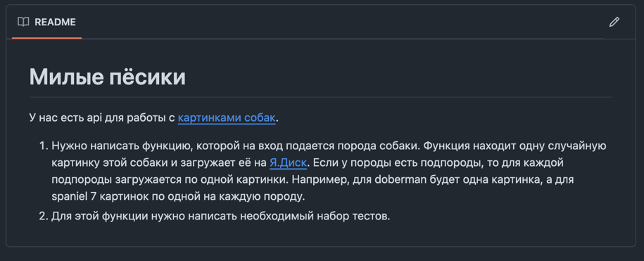
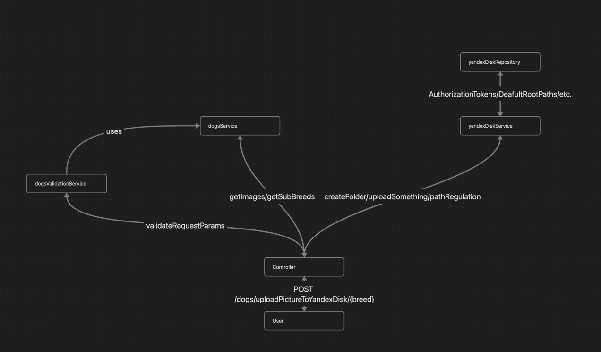
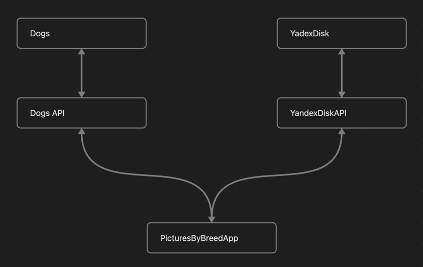
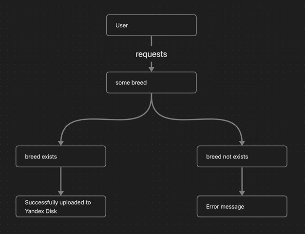
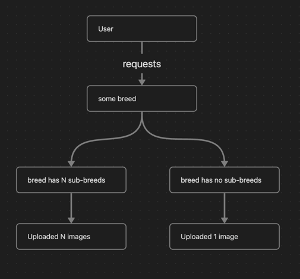
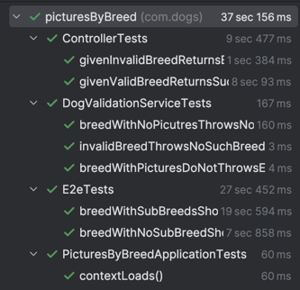

# Goals
This is an extended implementation of OZON weekend offer task which may be found by following link: https://github.com/eshmargunov/tech_intreview_full_task/tree/main

# Application structure

- As for any other webService PictureByBreed has to have strong foundation to grow without big troubles.
The MVC project structure allows us to separate the components from which the endpoint logic is assembled.
Task is not supposing the creation of front-end part, so the view components were not implemented

# Integration scheme

- An app has two dependencies: 
  availability of Dogs API and Yandex Disk API
- Interactions are using simple HTTP and API contracts
- Yandex Disk API: https://yandex.ru/dev/disk/poligon/
- Dogs API: https://dog.ceo/dog-api/documentation/

# App flow
### 1. Request validation(breed validation)
- User may enter the wrong breed. That's why we need to validate request params by requesting GET https://dog.ceo/api/breeds/list/all
### 2. Creation of root folder in Yandex Disk
- We want clear structure to gain better testablity. That's why we create a seprate root folder to which an app would upload all pictures by requesting PUT https://cloud-api.yandex.net/v1/disk/resources?path={path}
### 3. Determination of presence of a sub-breed
- The domain relation between images that should be uploaded and breeds from Dogs API is exactly 1to1. 
So the presence of a sub-breeds would affect requests to gain breeds images. That's why we separated flows for those breeds that have sub-breed(s) and others requesting GET https://dog.ceo/api/breed/{breed}}/list
### 4. Getting image(s) and uploading a picture to breed sub-folder if sub-breeds are absent or uploading sub-breed pictures to sub-breeds sub-folders
- Images urls are getting by requesting GET https://dog.ceo/api/breed/{breed}/{subBreed}/images/random for sub-breeds and GET https://dog.ceo/api/breed/{breed}/images/random for breeds
- Images are uploaded by requesting POST https://cloud-api.yandex.net/v1/disk/resources/upload?path={path}&url={url}
- PicturesByBreed is not a disposable app. So the final path where the image will be saved is clearly defined by the folder with the breed name(presence of a sub-breed), to provide the ability to fill the root folder with different breeds as the application is used. Sub-folder are created by requesting PUT https://cloud-api.yandex.net/v1/disk/resources?path={path}

# Test design
The main goal of test design is to cover the problem statements. Further expansion of coverage is possible and is achieved by specifying the requirements. Due to the limited ability to request feedback in the problem format, only the main statements and their logical consequences will be covered, namely:
- The dog breed is passed to the function input (Logical consequence: if a non-existent dog breed is passed, the user must return the corresponding answer)

- The function finds one random picture of this dog and uploads it to Yandex.Disk. If the breed has sub-breeds, then one picture is uploaded for each sub-breed. For example, there will be one picture for a Doberman, and 7 pictures for a Spaniel, one for each breed. (Logical consequence: if there are sub-breeds, we upload pictures for each sub-breed. If there are no sub-breeds, we upload a picture for the breed. According to the example, sub-breeds of depth 2 and more are not considered sub-breeds and should not be uploaded)

# Examples of units/components/integration tests
- You can find some by visiting [src/test/java/com/dogs/picturesByBreed](src%2Ftest%2Fjava%2Fcom%2Fdogs%2FpicturesByBreed)
- Coverage is not fully implemented. Current test coverage aims on demonstrating the ability to write different types of tests
- 

# Local manual testing 
You can test this yourself following the next steps: 
- clone github project
- docker compose up -d
- Swagger UI: http://localhost:8080/swagger-ui/index.html#/controller/uploadPictureToYandexDiskByBreed
- uploadPictureToYandexDiskByBreed endpoint uses the same token that we need to operate during work with yandex API.
 You may get the token from https://yandex.ru/dev/disk/poligon/
- For test purposes you can use test credentials: 
  - token: y0_AgAAAAB5jzSWAADLWwAAAAEVbWwbAACnQThdbhlL06q-zgLNNW5Ocoj5hw
  - login: picturesByBreedTestUser@yandex.ru 
  - password:PicturesByBreedTestUserPassword
  - diskLink: https://disk.yandex.ru/client/disk?source=main-loginmenu
- Choose any breed from https://dog.ceo/dog-api/documentation/
- Try out the application endpoint using Swagger -> profit if dependent services are available

# Logging
- Includes requests and reponses and could be checked out by running application locally

# CI
- Sorry, did not have enough time 5/2